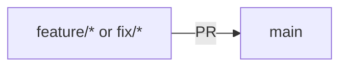

# Personal Assistant

A command-line Personal Assistant for managing contacts and notes. Built as a final project for the Python Programming: Foundations and Best Practices course.

## Description

This Personal Assistant is designed to help you manage your personal information efficiently through an intuitive command-line interface. It serves as both a practical application and a demonstration of team collaboration, software development best practices, and project management skills.

### Key Features

<!-- TODO: Features will be implemented. Planned features include:

- **Contact Management**
  - Store contacts with names, addresses, phone numbers, emails, and birthdays
  - Validate phone numbers and email addresses during entry
  - Search contacts by various criteria
  - Edit and delete contact records
  - Display upcoming birthdays within a specified number of days

- **Notes Management**
  - Create and store text notes
  - Search, edit, and delete notes
  - (Optional) Add tags for better organization
  - (Optional) Search and sort notes by tags

- **Data Persistence**
  - All data stored securely on disk in the user's home directory
  - Application can be restarted without data loss
-->

## Installation

### Prerequisites

- [uv](https://github.com/astral-sh/uv) package manager

### Quick Start

1. Clone the repository:
   ```bash
   git clone https://github.com/gornostay25/goit-python-final-project.git
   cd goit-python-final-project
   ```

2. Install dependencies:
   ```bash
   uv sync
   ```

That's it! uv automatically creates a virtual environment (`.venv`) and installs all dependencies including dev dependencies (ruff, pre-commit). No manual activation needed when using `uv run`.

To install only production dependencies (excluding dev tools), use:
```bash
uv sync --no-dev
```


## Usage

### Running the Application

Start the Personal Assistant:

```bash
uv run python -m app
```

Alternatively, run the script directly:

```bash
uv run src/app/__main__.py
```


<!-- TODO: Add example commands once functionality is implemented -->

## Development

### Project Structure

```
goit-python-final-project/
├── .github/
│   └── workflows/
│       └── ruff.yml              # GitHub Actions workflow for Ruff CI
├── .gitignore                 # Git ignore patterns
├── .pre-commit-config.yaml     # Pre-commit hooks configuration
├── .python-version            # Python version pin
├── LICENSE                    # MIT License
├── pyproject.toml             # Project configuration
├── README.md                  # This file
├── src/
│   └── app/
│       ├── __init__.py        # Package initialization
│       ├── __main__.py        # Entry point
│       └── cli.py             # CLI implementation
└── tests/
    └── __init__.py            # Test package
```

### Development Setup

1. Ensure dependencies are installed:
   ```bash
   uv sync
   ```

   Note: The dev dependency group is installed by default. Use `uv sync --no-dev` to exclude dev dependencies.

2. Add new dependencies:
   ```bash
   uv add <package-name>
   ```

3. Add development dependencies:
   ```bash
   uv add --dev <package-name>
   ```

4. Run linting:
   ```bash
   uv run ruff check src/
   ```

5. Format code:
   ```bash
   uv run ruff format src/
   ```

### Pre-commit Hooks

This project uses [pre-commit](https://pre-commit.com/) for automated code quality checks before commits.

To set up pre-commit hooks:

1. Ensure dependencies are installed:
   ```bash
   uv sync
   ```

2. Install the pre-commit hooks:
   ```bash
   uv run pre-commit install
   ```

Now the hooks will run automatically before each commit. To run them manually:
   ```bash
   uv run pre-commit run --all-files
   ```

The pre-commit configuration includes:
- **ruff**: Python linter with auto-fix
- **ruff-format**: Python code formatter
- **General checks**: Trailing whitespace, end-of-file fixer, YAML validation, etc.

### Git Workflow

This project follows a simple Git workflow to maintain code quality:

#### Branches

- **main**: Production branch (protected, no direct pushes)
- **feature/***: Feature implementation branches
- **fix/***: Bugfix branches

#### Pull Request Workflow

1. Create a new branch from `main`:
   ```bash
   # For a new feature
   git checkout main
   git pull origin main
   git checkout -b feature/your-feature-name

   # For a bugfix
   git checkout -b fix/your-fix-name
   ```

2. Make your changes and commit them

3. Push your branch:
   ```bash
   git push origin feature/your-feature-name
   ```

4. Create a Pull Request to merge into `main`

5. After review and approval, merge the PR into `main`

#### Merge Flow



### GitHub Actions

This project uses GitHub Actions for automated code quality checks:

#### Ruff CI

The [`.github/workflows/ruff.yml`](.github/workflows/ruff.yml) workflow runs on:
- Push to `main`, `feature/*`, `fix/*` branches
- Pull requests to `main` branch

It automatically runs Ruff checks on your code to ensure code quality before merging.

<!-- TODO: Testing section will be added once tests are implemented -->

## Contributing

This is a team project developed by:
- [Volodymyr Palamar](https://gornostay25.dev)
- [Liudmyla Slipko](https://github.com/slipkoliudmyla)
- [Aurika](https://github.com/diagnosel)
- [Daniil Kukhar](https://github.com/)

### Contribution Guidelines

1. Create a new branch for your feature or bugfix
2. Write clear, descriptive commit messages
3. Ensure all tests pass
4. Follow the existing code style (enforced by ruff)
5. Submit a pull request for review

### Team Roles

- **Team Lead**: Coordinates project direction and team collaboration (Volodymyr Palamar)
- **Scrum Master**: Manages tasks using Trello and ensures sprint goals are met (Liudmyla Slipko)
- **Developer**: Implements features and bug fixes (Aurika, Daniil Kukhar)

## License

This project is licensed under the MIT License - see the [LICENSE](LICENSE) file for details.

## Acknowledgments

This project was developed as part of the **Python Programming: Foundations and Best Practices** course. Special thanks to the instructors and team members for their collaboration and support.
